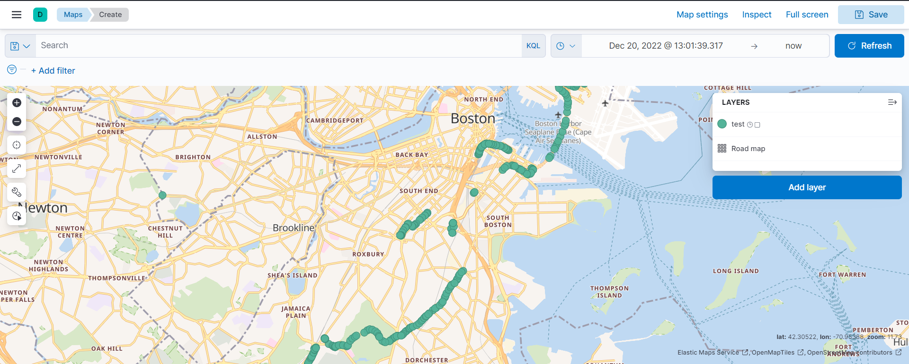

<h1 align="center">
  <br>
    Real-time-Geospatial-analysis-of-transport-data
</h1>
<div align="center">
  <h4>
    <a href="#overview">Overview</a> |
    <a href="#prerequisites">Requirements</a> |
    <a href="#how-to-run">User guide</a> |
    <a href="#data-preprocessing">Data preprocessing</a> |
    <a href="#spark-ml-pipeline">Dashboard</a> |
    <a href="#contribution">Contribution</a>
  </h4>
</div>
<br>


## Overview
This project is a data processing pipeline that implements a complete end-to-end real-time geospatial analysis and visualization solution using Kibana.
This multi-component solution was built as a demonstration of the capabilities
what can be done with modern open-source technologies, especially Apache
Spark, kafka and elasticsearch


## Requirements
 You should to install the following technologies to test the project
- Spark (spark-3.3.0-bin-hadoop3)
- Kafka (kafka_2.12-3.2.0)
- ElasticSearch (elasticsearch-7.17.0)
- Kibana (kibana-7.17.0)
- Note that you need to get api Key for the data streaming following this link : 
https://api-v3.mbta.com/login

## User guide
Make sure all the requirement with the listed versions are installed . 
1. Start Kafka Zookeeper
``` shell
bin/zookeeper-server-start.sh config/zookeeper.properties
```
2. Start Kafka 
``` shell
bin/kafka-server-start.sh config/server.properties
```
3. Run the producer.py and add your api key 
4. Start ElasticSearch
``` shell
cd $PATH-to-bin-file
./bin/elasticSearch
```
5. Start Kibana
``` shell
cd $PATH-to-bin-file
./bin/kibana
```
Create and index according to the following mapping : 

PUT test 
```json

{"mappings": {
    "properties": {
      "timestamp": { "type": "date" },
      "event" : {"type": "text"},
      "type" : {"type": "text"},
      "bearing" : {"type": "text"},
      "current_status" : {"type": "text"},
       "current_stop_sequence" : {"type": "text"},
       "label" : {"type": "text"},
       "latitude" : {"type": "double"},
       "longitude" : {"type": "text"},
        "coordinates" : {"type": "geo_point"},
        "speed" : {"type": "text"},
        "update_at" : {"type": "date"},
        "route" : {"type": "text"},
        "stop" : {"type": "text"},
        "trip" : {"type": "text"},
        "total_distance":{"type":"float"}
      
    }
  }
}

```
6. Run the consumer_es.py 
``` shell
spark-submit  --master local --driver-memory 2g --executor-memory 1g --packages org.apache.spark:spark-sql-kafka-0-10_2.12:3.3.0,org.elasticsearch:elasticsearch-spark-30_2.12:7.17.0 consumer_es.py

```
6. Run the calcul_distance.py 
``` shell
spark-submit  --master local --driver-memory 2g --executor-memory 1g --packages org.apache.spark:spark-sql-kafka-0-10_2.12:3.3.0 calcul_distance.py
```

## Dashbord
Using the kibana dashboard we can visualise a map with the trajectory travelled by the means of transport 



## Contribution

Imen Azzouz
Toumi Mohamed Amine
